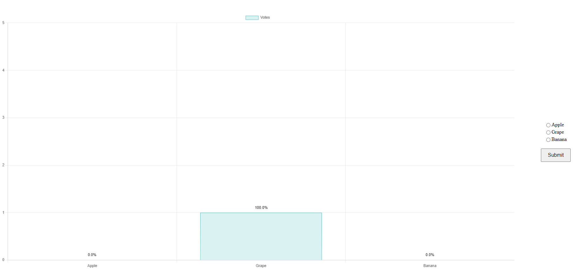

## 설치 및 실행

### 요구 사항

- [.NET 8 SDK](https://dotnet.microsoft.com/download/dotnet/8.0)
- [Node.js 및 npm](https://nodejs.org) (JavaScript 빌드에 필요)

### 설치 방법
초기 빌드시 npm 패키지 설치가 포함되어 있어 다소 시간이 걸릴 수 있습니다.

   ```bash
   git clone https://github.com/oopmania/simple-vote.git
   cd simple-vote

   dotnet build
   dotnet run
   ```

### 실행 방법

브라우저에서 `http://localhost:5001`로 접속하여 애플리케이션에 접근합니다.
<br>
동일 IP 접근에 대해서 중복 투표가 불가합니다.

